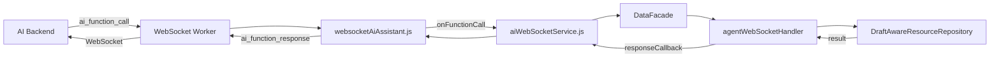

# 🎯 AI Function Calls - Rezumat Complet

## ✅ Ce am implementat

### 1. **Flow complet websocketAiAssistant → agentWebSocketHandler → DataFacade**



---

## 📁 Fișiere Modificate/Create

### ✏️ **Modificate:**

1. **`src/data/infrastructure/websocketAiAssistant.js`**
   - ✅ Adăugat `handleFunctionCall(payload)` - primește function calls
   - ✅ Adăugat `sendFunctionResponse()` - trimite răspunsuri către AI

2. **`src/data/DataFacade.js`**
   - ✅ Conectat `agentWebSocketHandler` la constructor
   - ✅ Adăugat `executeAIFunctionCall()` - execută function calls

3. **`src/services/aiWebSocketService.js`**
   - ✅ Actualizat `onFunctionCall` callback - execută prin DataFacade
   - ✅ Adăugat auto-trimitere răspuns către AI

### 📄 **Create:**

4. **`src/data/infrastructure/agentWebSocketHandler.js`** (RESCRIS COMPLET)
   - ✅ `executeAIFunctionCall()` - punct de intrare pentru AI
   - ✅ `handleCreateResource()` - creează resurse
   - ✅ `handleUpdateResource()` - actualizează resurse
   - ✅ `handleDeleteResource()` - șterge resurse
   - ✅ `handleGetResource()` - obține resurse
   - ✅ `handleQueryResources()` - interogare resurse
   - ✅ `handleSearchResources()` - căutare resurse
   - ✅ Logging în IndexedDB
   - ✅ Error handling complet

5. **`AI_FUNCTION_CALLS_FLOW.md`**
   - 📖 Documentație completă a flow-ului
   - 📊 Formate mesaje
   - 🔧 Lista funcțiilor disponibile
   - 📝 Exemple de utilizare

6. **`AI_FUNCTION_CALLS_EXAMPLE.md`**
   - 🎓 Exemple practice
   - ⚛️ Component React complet
   - 🔍 Debugging și troubleshooting
   - 🧪 Testing examples

---

## 🔄 Flow-ul Complet (Step by Step)

### 📥 **Primirea Function Call:**

1. **AI Backend (Elixir)** trimite prin WebSocket:
   ```elixir
   Phoenix.Channel.push(socket, "ai_function_call", %{
     callId: "fc_123",
     functionName: "createResource",
     parameters: %{
       resourceType: "appointment",
       data: %{...}
     }
   })
   ```

2. **WebSocket Worker** (`ai-websocket-worker.js`) primește și forward:
   ```javascript
   self.postMessage({
     type: 'message',
     data: {
       type: 'ai_function_call',
       data: payload
     }
   });
   ```

3. **websocketAiAssistant.js** procesează:
   ```javascript
   handleWorkerMessage(data) {
     case 'ai_function_call':
       this.handleFunctionCall(payload);
   }
   
   handleFunctionCall(payload) {
     if (this.onFunctionCall) {
       await this.onFunctionCall(payload);
     }
   }
   ```

4. **aiWebSocketService.js** execută:
   ```javascript
   this.aiAssistantInstance.onFunctionCall = async (payload) => {
     const result = await this.dataFacade.executeAIFunctionCall(
       payload,
       (response) => {
         this.aiAssistantInstance.sendFunctionResponse(...);
       }
     );
   };
   ```

5. **DataFacade.js** delegă către handler:
   ```javascript
   async executeAIFunctionCall(payload, responseCallback) {
     return await agentWebSocketHandler.executeAIFunctionCall(
       payload,
       responseCallback
     );
   }
   ```

6. **agentWebSocketHandler.js** execută funcția:
   ```javascript
   async executeAIFunctionCall(payload, responseCallback) {
     const handler = this.messageHandlers.get(functionName);
     const result = await handler(parameters);
     
     // Log în DB
     await db.table('aiFunctionCalls').add({...});
     
     // Trimite răspunsul
     responseCallback({
       callId, functionName, success: true, result
     });
   }
   ```

7. **Handler specific** (ex: `handleCreateResource`):
   ```javascript
   async handleCreateResource(parameters) {
     const { resourceType, data } = parameters;
     const result = await this.dataFacade.create(resourceType, data);
     return { operation: 'create', resourceType, resource: result };
   }
   ```

### 📤 **Trimiterea Răspunsului:**

8. **responseCallback** apelat în `aiWebSocketService.js`:
   ```javascript
   (response) => {
     this.aiAssistantInstance.sendFunctionResponse(
       response.callId,
       response.functionName,
       response.success,
       response.result,
       response.error
     );
   }
   ```

9. **websocketAiAssistant.js** trimite prin worker:
   ```javascript
   sendFunctionResponse(callId, functionName, success, result, error) {
     this.worker.postMessage({
       type: 'send',
       data: {
         event: 'ai_function_response',
         payload: { callId, functionName, success, result, error }
       }
     });
   }
   ```

10. **WebSocket Worker** trimite către backend:
    ```javascript
    channel.push('ai_function_response', payload);
    ```

11. **AI Backend** primește și procesează răspunsul:
    ```elixir
    def handle_in("ai_function_response", payload, socket) do
      # AI procesează rezultatul și răspunde utilizatorului
      {:noreply, socket}
    end
    ```

---

## 🎯 Funcții Disponibile

| Funcție | Descriere | Parametri | Rezultat |
|---------|-----------|-----------|----------|
| `createResource` | Creează resursă | `resourceType`, `data` | `{ operation, resourceType, resource }` |
| `updateResource` | Actualizează resursă | `resourceType`, `id`, `data` | `{ operation, resourceType, id, resource }` |
| `deleteResource` | Șterge resursă | `resourceType`, `id` | `{ operation, resourceType, id, success }` |
| `getResource` | Obține resursă | `resourceType`, `id` | `{ operation, resourceType, id, resource }` |
| `queryResources` | Interogare resurse | `resourceType`, `params` | `{ operation, resourceType, resources, count }` |
| `searchResources` | Căutare resurse | `resourceType`, `searchField`, `searchTerm` | `{ operation, resourceType, resources, count }` |

---

## 📊 Resource Types Disponibile

✅ Toate resource types din DataFacade:

- `appointment` - Programări
- `patient` - Pacienți  
- `product` - Produse
- `medic` - Medici
- `treatment` - Tratamente
- `sale` - Vânzări
- `role` - Roluri
- `permission` - Permisiuni
- `setting` - Setări
- `dental-chart` - Fișe dentare
- `plan` - Planuri de tratament
- `invoice` - Facturi
- `invoice-client` - Clienți facturi

---

## 🔍 WebSocket Topics

### Topic pentru AI Assistant:
```javascript
Topic: `messages:${businessId}`
Events:
  - Primite: ai_function_call, new_message
  - Trimise: ai_function_response, send_message, heartbeat
```

### Topic pentru Resurse:
```javascript
Topic: `resources:${businessId}-${locationId}`
Events:
  - Primite: message, agent_request, status
  - Trimise: custom events
```

---

## ✅ Features Implementate

### 🎯 Core Functionality:
- ✅ Primire AI function calls prin WebSocket
- ✅ Execuție prin DataFacade cu toate repository-urile
- ✅ Returnare automată a răspunsurilor către AI
- ✅ Support pentru toate operațiile CRUD
- ✅ Support pentru search și query

### 📝 Logging & Monitoring:
- ✅ Toate function calls loggate în IndexedDB (`aiFunctionCalls` table)
- ✅ Timestamp pentru fiecare operațiune
- ✅ Status tracking (executing, completed, failed)
- ✅ Error messages detaliate
- ✅ Console logging cu emoji-uri distinctive

### 🛡️ Error Handling:
- ✅ Try-catch la toate nivelurile
- ✅ Validare parametri
- ✅ Error messages descriptive
- ✅ Trimitere erori către AI
- ✅ Graceful degradation

### 🔄 Integration:
- ✅ Conectare automată DataFacade ↔ agentWebSocketHandler
- ✅ Callback system pentru notificări custom
- ✅ Support pentru demo mode
- ✅ Timeout management (30s)

---

## 🧪 Cum să testezi

### Test rapid în consolă:

```javascript
// 1. Verifică status
window.dataFacade.getAgentWebSocketStatus();

// 2. Simulează function call
const testPayload = {
  callId: 'test_123',
  functionName: 'createResource',
  parameters: {
    resourceType: 'patient',
    data: {
      name: 'Test Patient',
      phone: '0721111111',
      email: 'test@example.com'
    }
  },
  timestamp: new Date().toISOString()
};

// 3. Execută
const result = await window.dataFacade.executeAIFunctionCall(
  testPayload,
  (response) => console.log('Response:', response)
);

console.log('Result:', result);
```

---

## 📖 Documentație Completă

1. **`AI_FUNCTION_CALLS_FLOW.md`** - Flow complet și formate mesaje
2. **`AI_FUNCTION_CALLS_EXAMPLE.md`** - Exemple practice și component React
3. **`AI_FUNCTION_CALLS_SUMMARY.md`** - Acest document (overview general)

---

## 🚀 Status: ✅ COMPLET FUNCȚIONAL

Sistemul este **gata de utilizare**! 

AI poate acum să:
- ✅ Creeze programări, pacienți, produse, etc.
- ✅ Actualizeze resurse existente
- ✅ Șteargă resurse
- ✅ Caute și interogeze date
- ✅ Primească feedback automat despre succes/eșec

**Flow-ul este complet automat - nu trebuie configurare suplimentară!** 🎉

---

## 📞 Next Steps (Pentru Backend Elixir)

Backend-ul trebuie să:

1. **Trimită function calls** cu formatul:
```elixir
%{
  callId: "fc_#{timestamp}",
  functionName: "createResource" | "updateResource" | ...,
  parameters: %{
    resourceType: "appointment",
    data: %{...}
  },
  timestamp: DateTime.utc_now()
}
```

2. **Primească răspunsuri** cu formatul:
```elixir
%{
  callId: "fc_123",
  functionName: "createResource",
  success: true | false,
  result: %{...} | nil,
  error: "error message" | nil,
  timestamp: DateTime
}
```

3. **Proceseze rezultatele** și răspundă utilizatorului

---

## 🎓 Concluzie

Ai acum un **sistem complet funcțional** de AI function calls care:

✅ Primește comenzi de la AI prin WebSocket  
✅ Execută operațiuni CRUD prin DataFacade  
✅ Returnează rezultate automat către AI  
✅ Loghează toate operațiunile  
✅ Gestionează erori elegant  
✅ Este ușor de extins cu funcții noi  

**Succes cu implementarea! 🚀**

